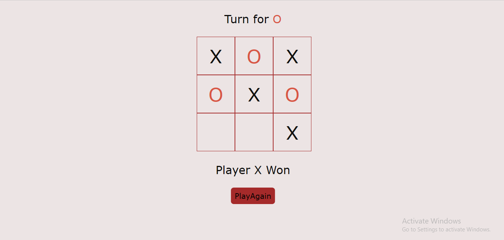

# Project README

This project was given by Prodigy Infotech as Task 3 in the domain Web Development.

## Description

This project is an Tic-Tac-Toe  Web Game. It displays the player who wins the match  and tie.

Languages used: HTML, CSS, JavaScript

  

## File Structure

- `index.html`: The main HTML file for the webpage.
- `styles.css`: Directory containing CSS stylesheets.
- `index.js`: Directory containing Javascript functions.
  
